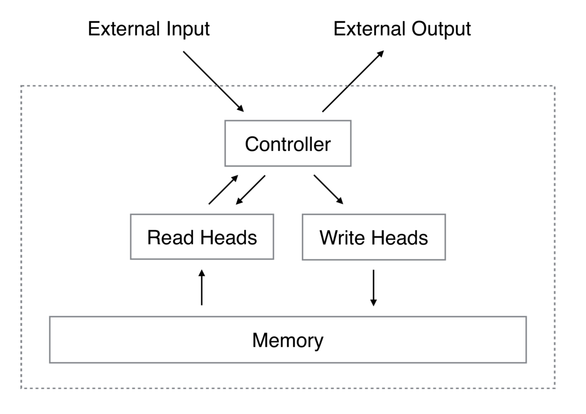

# Neural-Turing-Machine

Using Tensorflow framework to implement NTM, which is the architecture proposed by Google DeepMind in 2014.

See more info in [Neural Turing Machine](https://arxiv.org/abs/1410.5401)

Basic Architecture
------------------

